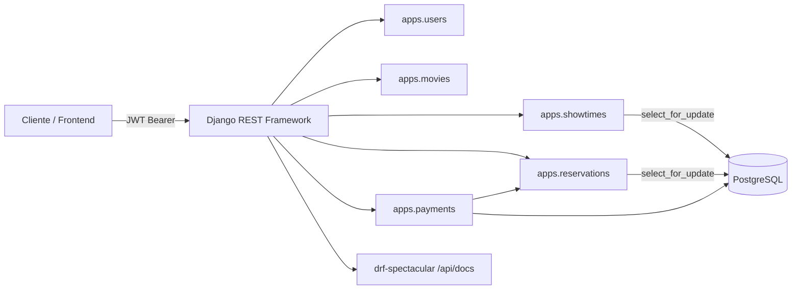

# Cine API

API REST para la gestión y venta de boletos de cine: catálogo de películas, cines/salas, funciones con mapa de asientos en tiempo real, reservas con expiración automática y procesamiento de pagos simulado con emisión de tickets.


## Descripción

Backend de un sistema de venta de entradas de cine construido con Django REST Framework. Resuelve el problema de **coordinar el inventario de asientos en un entorno concurrente**: cuando varios usuarios intentan reservar el mismo asiento al mismo tiempo, la API bloquea las filas afectadas a nivel de base de datos, aplica un *hold* temporal con expiración automática y libera el asiento si el pago no se completa a tiempo.

Expone autenticación por JWT, un panel de operaciones para administradores (películas, cines, salas, funciones, usuarios, reservas y reembolsos) y un flujo de pago simulado con validación de tarjeta e idempotencia para evitar cobros duplicados.

## Índice

- [Características](#características)
- [Tecnologías](#tecnologías)
- [Arquitectura](#arquitectura)
- [Requisitos previos](#requisitos-previos)
- [Instalación y configuración local](#instalación-y-configuración-local)
- [Variables de entorno](#variables-de-entorno)
- [Ejecución](#ejecución)
- [Estructura del proyecto](#estructura-del-proyecto)
- [Documentación de la API](#documentación-de-la-api)
- [Endpoints principales](#endpoints-principales)
- [Flujo de negocio: reserva → pago → ticket](#flujo-de-negocio-reserva--pago--ticket)
- [Pruebas](#pruebas)
- [Docker](#docker)


## Características

Verificadas directamente en el código fuente:

- **Catálogo de películas** con filtros (género, clasificación, rango de estreno, duración), búsqueda y ordenamiento.
- **Gestión de cines, salas y funciones**, con generación automática de asientos según la configuración de cada sala.
- **Mapa de asientos por función** en tiempo real, con precios diferenciados por tipo de asiento (estándar, VIP, accesible).
- **Reservas con hold temporal**: los asientos elegidos quedan bloqueados por `HOLD_MINUTOS` (por defecto 10) y se liberan automáticamente si no se paga a tiempo.
- **Control de concurrencia** con `select_for_update` y un campo de versión optimista (`version`) en cada asiento de función, para evitar doble venta.
- **Pagos simulados** con validación de número de tarjeta (algoritmo de Luhn), tarjetas de prueba que se rechazan intencionalmente, e **idempotencia** vía cabecera `Idempotency-Key` para evitar cobros duplicados en reintentos.
- **Emisión de ticket con código QR** al aprobarse un pago.
- **Reembolsos** administrativos sobre pagos aprobados.
- **Autenticación JWT** (access/refresh) con modelo de usuario propio (login por email) y roles `cliente` / `admin`.
- **Panel administrativo vía API** para películas, cines, salas, funciones, usuarios y reservas, separado de los endpoints públicos.
- **Documentación OpenAPI/Swagger** autogenerada con `drf-spectacular`.
- **Manejo de errores homogéneo**: todas las excepciones de dominio (asiento no disponible, reserva expirada, operación inválida) devuelven un formato JSON consistente con código de error y `request_id`.
- **Middleware de trazabilidad** (`RequestIDMiddleware`) que agrega un `X-Request-ID` a cada respuesta y registra método, ruta, status y tiempo de respuesta.
- **Comando de expiración de reservas** (`expirar_reservas`) ejecutable una vez o en bucle, pensado para un proceso periódico (cron/worker).
- **Comando de importación desde TMDB** (`importar_tmdb`) para reemplazar el catálogo semilla con datos reales de películas (opcional, requiere API key propia).
- **Datos de demostración** (`seed_cine`) que generan géneros, películas, cines, salas, funciones y usuarios de prueba.

## Tecnologías

| Categoría | Tecnología |
|---|---|
| Framework web | Django 5.1.6 |
| API REST | Django REST Framework 3.15.2 |
| Autenticación | djangorestframework-simplejwt 5.4.0 |
| Base de datos | PostgreSQL (driver `psycopg2-binary`) |
| Filtrado | django-filter 24.3 |
| Documentación API | drf-spectacular 0.28.0 (OpenAPI + Swagger UI) |
| CORS | django-cors-headers 4.7.0 |
| Configuración | python-decouple 3.8 |
| Archivos estáticos | whitenoise 6.8.2 |
| Servidor WSGI (prod) | gunicorn 23.0.0 |
| Cliente HTTP | requests 2.32.3 (integración TMDB) |
| Testing | pytest 8.3.4, pytest-django 4.9.0 |
| Contenedores | Docker (`python:3.12-slim`) |

## Arquitectura

Proyecto Django organizado por **apps de dominio**, con configuración de settings dividida por entorno:

```
config/settings/
├── base.py   # configuración común (apps, DB, JWT, DRF, CORS, logging)
├── dev.py    # DEBUG=True, CORS abierto
└── prod.py   # cabeceras de seguridad, cookies seguras, HSTS
```

Cada app de dominio sigue el mismo patrón: `models.py` → `services.py` (lógica de negocio y transacciones) → `serializers.py` → `views.py` (delgadas, delegan en `services`) → `urls.py`. Las reglas de negocio complejas (reservas, pagos, disponibilidad de asientos) viven en `services.py`, no en las vistas.



> Nota: `CORS_ALLOWED_ORIGINS` incluye por defecto `http://localhost:5173` (puerto típico de Vite), lo que sugiere que este backend está pensado para ser consumido por un frontend separado, pero dicho frontend no forma parte de este repositorio.

## Requisitos previos

- Python 3.10 o superior (entorno de desarrollo verificado con 3.10; la imagen Docker usa 3.12).
- PostgreSQL en ejecución (local o remoto).
- pip / virtualenv.

## Instalación y configuración local

```bash
# 1. Clonar el repositorio y ubicarse en la carpeta del backend
git clone <URL_DEL_REPOSITORIO>
cd backend_cine

# 2. Crear y activar un entorno virtual
python -m venv .venv
# Windows
.venv\Scripts\activate
# Linux / macOS
source .venv/bin/activate

# 3. Instalar dependencias de desarrollo (incluye pytest)
pip install -r requirements/dev.txt

# 4. Copiar el archivo de variables de entorno de ejemplo
cp .env.example .env
# Editar .env con los datos de tu base de datos local

# 5. Aplicar migraciones
python manage.py migrate

# 6. (Opcional) Cargar datos de demostración
python manage.py seed_cine
```

## Variables de entorno

Definidas en `.env.example` (sin valores reales). Copiar a `.env` y completar:

| Variable | Descripción | Valor por defecto |
|---|---|---|
| `DJANGO_SETTINGS_MODULE` | Módulo de settings a usar | `config.settings.dev` |
| `SECRET_KEY` | Clave secreta de Django | `cambia-esta-clave` *(placeholder, reemplazar)* |
| `DEBUG` | Modo debug | `True` |
| `ALLOWED_HOSTS` | Hosts permitidos, separados por coma | `localhost,127.0.0.1` |
| `DB_NAME` | Nombre de la base de datos PostgreSQL | `cine` |
| `DB_USER` | Usuario de PostgreSQL | `postgres` |
| `DB_PASSWORD` | Contraseña de PostgreSQL | *(vacío, completar)* |
| `DB_HOST` | Host de PostgreSQL | `localhost` |
| `DB_PORT` | Puerto de PostgreSQL | `5432` |
| `CORS_ALLOWED_ORIGINS` | Orígenes permitidos para CORS, separados por coma | `http://localhost:5173` |
| `HOLD_MINUTOS` | Minutos que un asiento queda bloqueado tras iniciar una reserva | `10` |
| `ACCESS_TOKEN_MINUTOS` | Duración del access token JWT | `60` |
| `REFRESH_TOKEN_DIAS` | Duración del refresh token JWT | `7` |
| `TMDB_API_KEY` | API key de [themoviedb.org](https://www.themoviedb.org/), solo necesaria para el comando `importar_tmdb` | *(vacío, opcional)* |

> El archivo `.env` está incluido en `.gitignore`: nunca se versiona con valores reales.

## Ejecución

```bash
python manage.py runserver
```

La API queda disponible en `http://127.0.0.1:8000/`.

Otros comandos de gestión relevantes:

```bash
# Liberar asientos con hold vencido y expirar reservas pendientes (ejecución única)
python manage.py expirar_reservas

# Ejecutarlo en bucle cada 60 segundos (para un worker/cron)
python manage.py expirar_reservas --intervalo 60

# Reemplazar el catálogo semilla con datos reales de TMDB (requiere TMDB_API_KEY)
python manage.py importar_tmdb

# Regenerar datos de demostración desde cero
python manage.py seed_cine --reset --dias 8
```

> `seed_cine` crea, entre otros datos, dos usuarios de prueba (`admin@cine.pe` y `demo@cine.pe`, contraseña `Cine2026!`) definidos en el propio código del comando. Son credenciales **exclusivas para entorno local de desarrollo**, no secretos de producción.

## Estructura del proyecto

```
backend_cine/
├── apps/
│   ├── core/            # utilidades comunes: paginación, excepciones, middleware, comando seed_cine
│   ├── users/            # modelo de usuario custom, autenticación JWT, administración de usuarios
│   ├── movies/           # catálogo de películas, géneros, importación TMDB
│   ├── showtimes/        # cines, salas, asientos, funciones, mapa de asientos
│   ├── reservations/      # reservas, hold de asientos, expiración
│   └── payments/          # pagos simulados, reembolsos, tickets
├── config/
│   ├── settings/          # base.py / dev.py / prod.py
│   ├── urls.py             # enrutamiento raíz (/admin, /api/v1, /api/docs)
│   ├── wsgi.py / asgi.py
├── requirements/
│   ├── base.txt / dev.txt / prod.txt
├── conftest.py            # fixtures compartidas de pytest
├── pytest.ini
├── Dockerfile
├── entrypoint.sh
├── manage.py
└── .env.example
```

## Documentación de la API

Generada automáticamente con `drf-spectacular`:

- Esquema OpenAPI: `GET /api/schema/`
- Interfaz Swagger interactiva: `GET /api/docs/`

## Endpoints principales

Todos los endpoints públicos y de cliente cuelgan del prefijo `/api/v1/`. Los que empiezan con `admin/` requieren rol `admin` (permiso `IsAdmin`).

**Autenticación** (`apps.users`)

| Método | Endpoint | Auth | Descripción |
|---|---|---|---|
| POST | `/api/v1/auth/register` | Pública | Registro de usuario, devuelve tokens JWT |
| POST | `/api/v1/auth/login` | Pública | Login, devuelve `access`/`refresh` y perfil |
| POST | `/api/v1/auth/refresh` | Pública | Renueva el access token |
| GET/PUT/PATCH | `/api/v1/auth/me` | JWT | Perfil del usuario autenticado |
| POST | `/api/v1/auth/password` | JWT | Cambio de contraseña |
| GET/POST | `/api/v1/admin/users` | Admin | Listado y creación de usuarios |
| GET/PATCH | `/api/v1/admin/users/{id}` | Admin | Detalle / cambio de rol o estado |

**Catálogo** (`apps.movies`)

| Método | Endpoint | Auth | Descripción |
|---|---|---|---|
| GET | `/api/v1/genres` | Pública | Listado de géneros |
| GET | `/api/v1/movies` | Pública | Listado de películas activas (filtros: `genero`, `genero_id`, `clasificacion`, `estreno_desde`, `estreno_hasta`, `duracion_max`; `search` por título/director/reparto; `ordering` por `fecha_estreno`, `titulo`, `calificacion`, `duracion_min`) |
| GET | `/api/v1/movies/{id}` | Pública | Detalle de película |
| GET/POST | `/api/v1/admin/movies` | Admin | Listado (incluye inactivas) y creación |
| GET/PUT/PATCH/DELETE | `/api/v1/admin/movies/{id}` | Admin | Detalle, edición y baja |

**Cines, salas y funciones** (`apps.showtimes`)

| Método | Endpoint | Auth | Descripción |
|---|---|---|---|
| GET | `/api/v1/cinemas` | Pública | Listado de cines |
| GET | `/api/v1/showtimes` | Pública | Funciones activas y futuras (filtros: `fecha`, `cine`, `sala`, `tipo_sala`) |
| GET | `/api/v1/showtimes/{id}` | Pública | Detalle de función |
| GET | `/api/v1/showtimes/{id}/seats` | Pública | Mapa de asientos de una función |
| GET | `/api/v1/movies/{id}/showtimes` | Pública | Funciones de una película |
| GET | `/api/v1/movies/{id}/showtime-dates` | Pública | Fechas con funciones disponibles para una película |
| GET/POST | `/api/v1/admin/cinemas`, `/api/v1/admin/rooms`, `/api/v1/admin/showtimes` | Admin | Alta de cines, salas y funciones |
| GET/PUT/PATCH/DELETE | `/api/v1/admin/cinemas/{id}`, `/api/v1/admin/rooms/{id}`, `/api/v1/admin/showtimes/{id}` | Admin | Gestión individual |

**Reservas** (`apps.reservations`)

| Método | Endpoint | Auth | Descripción |
|---|---|---|---|
| POST | `/api/v1/reservations` | JWT | Crea una reserva (bloquea asientos por `HOLD_MINUTOS`) |
| GET/DELETE | `/api/v1/reservations/{id}` | JWT (dueño o admin) | Consulta o cancela una reserva |
| GET | `/api/v1/users/me/reservations` | JWT | Reservas del usuario autenticado (filtro `estado`) |
| GET | `/api/v1/admin/reservations` | Admin | Listado de todas las reservas (filtros `estado`, `usuario`) |

**Pagos y tickets** (`apps.payments`)

| Método | Endpoint | Auth | Descripción |
|---|---|---|---|
| POST | `/api/v1/reservations/{id}/payment` | JWT | Procesa el pago de una reserva (header opcional `Idempotency-Key`) |
| GET | `/api/v1/reservations/{id}/payments` | JWT (dueño o admin) | Historial de pagos de una reserva |
| GET | `/api/v1/reservations/{id}/ticket` | JWT (dueño o admin) | Ticket con código QR de una reserva pagada |
| GET | `/api/v1/admin/payments` | Admin | Listado de pagos (filtro `estado`) |
| POST | `/api/v1/admin/payments/{id}/refund` | Admin | Reembolsa un pago aprobado |

## Flujo de negocio: reserva → pago → ticket

1. El cliente consulta `GET /showtimes/{id}/seats` para ver el mapa de asientos disponibles.
2. Crea una reserva con `POST /reservations` indicando `funcion_id` y hasta 10 `funcion_asiento_ids`. Los asientos quedan en estado `reservado` con un `reservado_hasta` calculado a partir de `HOLD_MINUTOS`.
3. Si no se paga antes de que expire el hold, el comando `expirar_reservas` (o el barrido automático que se dispara en operaciones de lectura de disponibilidad) libera los asientos y marca la reserva como `expirada`.
4. Si se paga a tiempo con `POST /reservations/{id}/payment`, el sistema valida la tarjeta (Luhn), aprueba o rechaza el pago, y si es aprobado marca los asientos como `ocupado`, confirma la reserva y emite un `Ticket` con código QR.
5. El cliente puede consultar su ticket en `GET /reservations/{id}/ticket`.
6. Un administrador puede reembolsar el pago desde `POST /admin/payments/{id}/refund`.

## Pruebas

Suite de tests con `pytest` + `pytest-django`, incluida en el repositorio (`apps/*/tests/`):

```bash
pytest
```

Cobertura verificada por área:
- Autenticación y perfil (`apps/users/tests/test_auth.py`).
- Permisos de administración por app (`test_admin.py` en `users`, `movies`, `showtimes`, `reservations`, `payments`).
- Catálogo público de películas y filtros (`apps/movies/tests/test_catalogo.py`).
- Mapa de asientos y liberación de holds vencidos (`apps/showtimes/tests/test_mapa_asientos.py`).
- **Concurrencia en reservas** con `TransactionTestCase` (`apps/reservations/tests/test_concurrencia.py`): doble reserva del mismo asiento, límite de asientos por reserva, cancelación y liberación.
- Pagos: aprobación, idempotencia, tarjeta inválida, reserva expirada, aislamiento entre usuarios (`apps/payments/tests/test_pagos.py`).

La configuración vive en `pytest.ini` (usa `config.settings.dev` y reutiliza la base de datos de test con `--reuse-db`).

## Docker

El repositorio incluye un `Dockerfile` productivo (no incluye `docker-compose.yml`, por lo que se debe disponer de una instancia de PostgreSQL accesible por separado):

```bash
docker build -t cine-api .
docker run --env-file .env -p 8000:8000 cine-api
```

El `entrypoint.sh` espera a que PostgreSQL esté disponible (`DB_HOST`/`DB_PORT`), aplica migraciones y ejecuta `collectstatic` antes de levantar `gunicorn` en el puerto `8000`.


